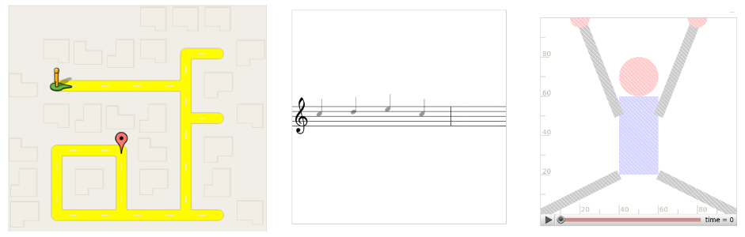

# Blockly

Lerne die Grundlagen hinter jeder Website, jeder App und jedes Computerspiels!

Du musst nur eine Menge Spaß und Interesse mitbringen - Vorkenntnisse brauchst du keine! 

Mit Blockly lernst du die Grundlagen des Programmierens spielend leicht - im wahrsten Sinne des Wortes.
Alle Aufgaben sind in Rätseln organisiert, wo du Labyrinthe löst, Musik komponierst oder Animationen programmierst.

Aber was ist Programmieren überhaupt? Arbeite die folgenden Kapitel und Rätsel Stück für Stück durch und finde es heraus!
