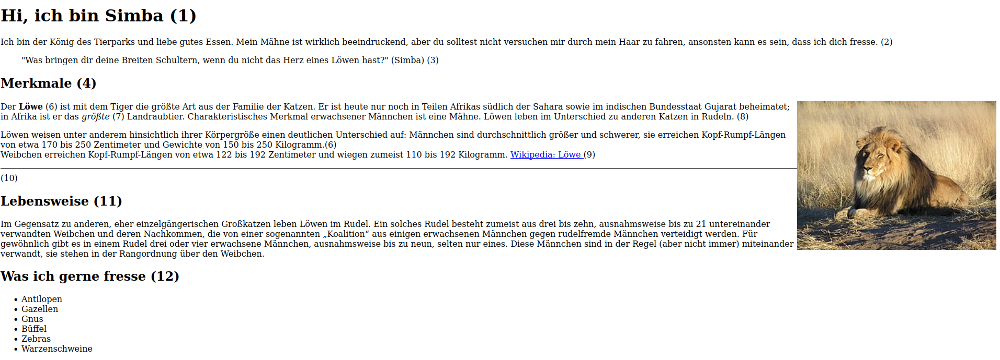

# How To Html

_by Felix Peter Paul_

Du willst also mal eine Website programmieren? Dann ist dieses kleine Buch genau das richtige um eine Website mit coolen Features wie Bilder, Ton, Video und sogar GoogleMaps Standorten zu erstellen. 
 

> Klicke auf das Bild. 
> Es öffnet sich die Seite eines Tierparks. 
> Scrolle durch die Website und gehe dann auf **"Unsere Tierwelt"**. Du siehst ganz viele Fotos von Tieren und unten eine Liste aller Tiere. Klicke auf **"Beispiel-Löwe"**. 

> ⚠️**Es erscheint eine Website wie auch du eine programmieren wirst.**

Das Buch ist in einzelne Kapitel aufgeteilt und du solltest auf keinen Fall ein Kapitel überspringen. Andernfalls werden im späteren Lücken auftreten, die du nur sehr schwer aufholen kannst.

Jedes Kapitel besteht aus einem Informations und einem Übungsteil. 
Lies zunächst den Informationsteil, um dann mit coolen Beispielen dein Wissen zu testen. 

Also legen wir los! 

>**Viel Spaß beim Programmieren wie ein echter WebDeveloper!**
