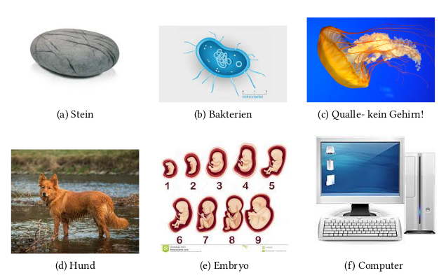

# Ki programmieren in Python

### Was ist Intelligenz?

> ### Der Turing Test (1950)

# Tic Tac Toe

Als Einstieg wollen wir eine einfache Tic-Tac-Toe KI schreiben! 

> ### ⚠️ Spielt erstmal 12 Runden gegen euren Sitznachbarn. Dafür habe ich ein Arbeitsblatt für euch. 

> **Auf der nächsten Seite seht ihr dann, wie ihr eure eigene TicTacToe KI schreibt!**
