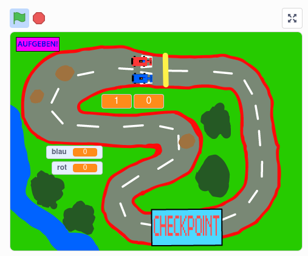
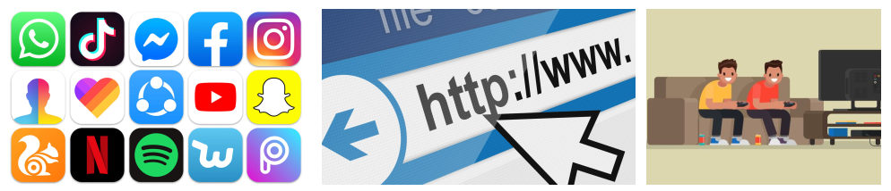
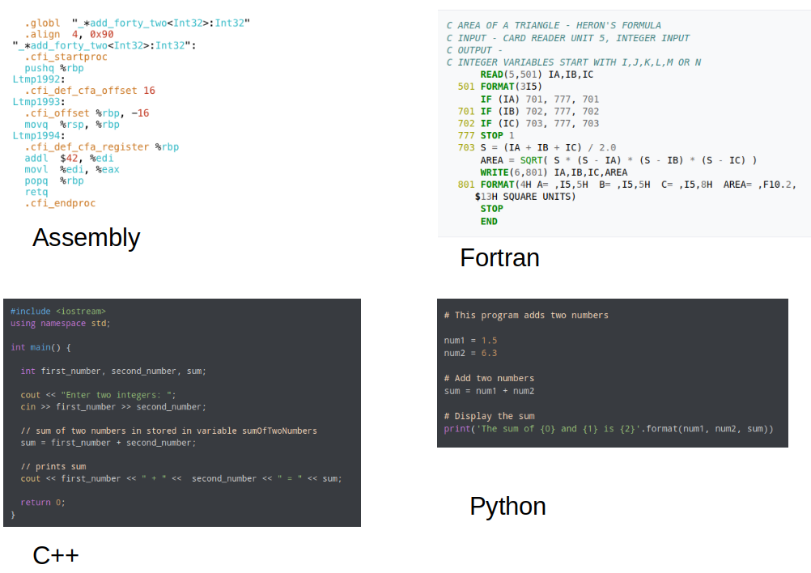
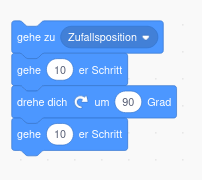

# Routenplaner mit Scratch

 

[Scratch](https://scratch.mit.edu/projects/editor/?tutorial=getStarted) ist eine Programmierumgebung, bei der man mit Blöcken, statt mit Codezeilen programmiert. 

- Scratch gibt es [online](https://scratch.mit.edu/projects/editor/?tutorial=getStarted), sodass man jederzeit direkt losprogrammiere kann. 

- Außerdem ist es auf den meisten **Schulcomputern** installiert.
 
# Code vs Blöcke, Ist da ein Unterschied?

Programmieren bschreibt die Tätigkeit mit Code Programme zu erstellen. Egal ob App, Website, Computerprogramm oder Videospiel. Im Grund werden alle gleich produziert. 

Ein Programmierer schreibt in einer Programmiersprache Anweisungen hintereinander, die der Computer durchführen soll. 

Es gibt hunderte von Programmiersprachen, so wie es auch über hundert Sprachen in der Welt gibt.
Alle können fast das gleiche, aber man muss die Anweisungen anders aufschreiben. 

Hier ein paar Beispiele.

 Die Programmiersprachen sind von alt nach neu sortiert. Es fällt auf, dass es immer einfacher wurde zu programmieren. 

Heute muss man nicht mehr unbedingt mit Texten programmieren - man kann Baukästen nutzen, wobei jeder Baukasten für eine Zeile Code aus den Beispielen oben steht. 

Vorteil des Baukastens ist, dass man sich **nicht vertippen** kann und trotzdem die **gleiche Aufgabe löst**. 

Deshalb benutzt du **Scratch**. Es ist einfach zu programmieren, aber du machst genau das gleiche wie die Programmierer bei Google, Microsoft oder Facebook. 

Also los gehts.
