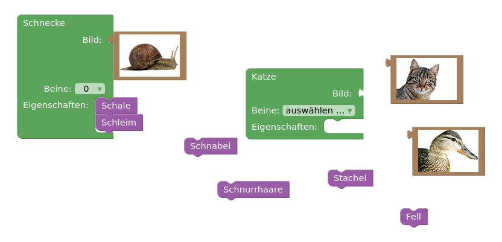
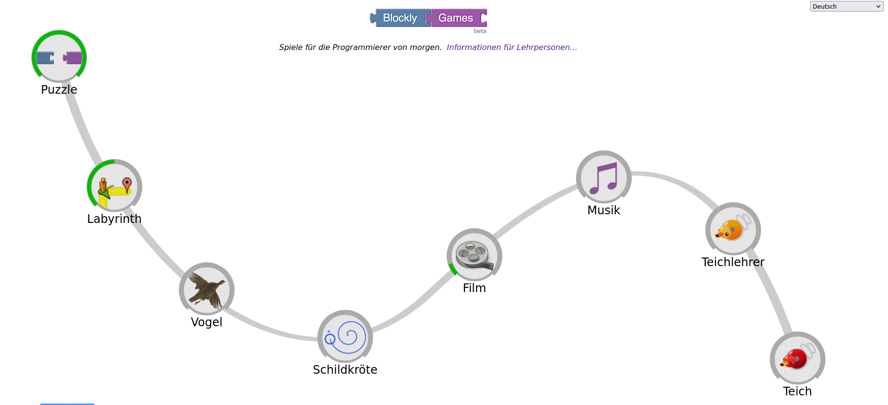

# Aufgaben

Wie du bereits weißt, arbeitet Blockly mit Blöcken statt Codezeilen. 

Zunächst machst du dich mit Blöcken und deren Handhabung vertraut, indem du die Tiere ihren Eigenschaften zuweist.
Versuche auch Blöcke wieder zu entfernen!

Oben rechts ist ein **Hilfe**knopf, solltest du mal Probleme haben. 
Nachdem du eine Aufgabe gemacht hast, überprüfe sie mit dem roten "**Antwort überprüfen**" Knopf!

> Gehe dazu auf [Blockly](https://blockly.games/puzzle?lang=de) und löse das Puzzle.
Sobald du also das Puzzle abgeschlossen hast  löse die restlichen Rätsel entlang des Weges.
Wie viele Rätsel kannst du lösen?

