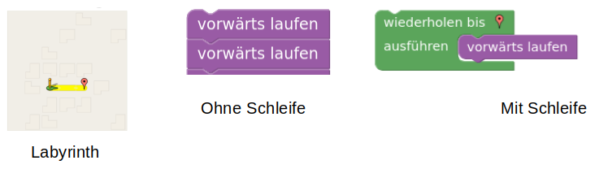
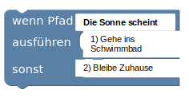
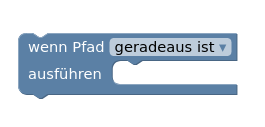
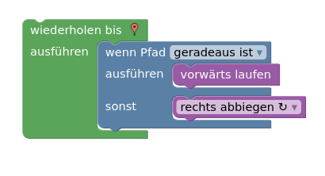
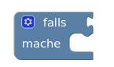
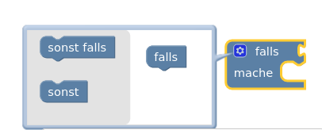
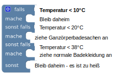

# Tipps

## Schleifen

Schleifen wiederholen einen Befehl mehrmals. Anstatt so oft einen geradeaus-Block hintereinander zu reihen bis man am Ziel ist kann man einfach eine Schleife um den geradeaus-Befehl machen. Dadurch geht man solange geradeaus, bis man am Ziel ist. 

## Bedingungen 

Mit Bedingungen kannst du einen "Wenn dann" Aussagen programmieren. 

Zum Beispiel kannst du programmieren:

1. **Wenn die Sonne scheint** gehe ich ins Schwimmbad.

2. Sonst bleibe ich zu Hause.

Das obige Beispiel entspricht dem unteren Codeblock. 

Bemerke, dass jede Bedingung gleich aufgebaut ist.

- Sie enthält eine Bedingung (**Wenn** die Sonne scheint)

- Eine **Dann** Aussage (Gehe ins Schwimmbad)

- Eine **Sonst** Aussage (Bleibe Zuhause)

Die Sonst Aussage kann man auch weglassen, wie man anhand des unteren Codeblocks sieht.

> ⚠️ Man kann auch eine Schleife in einer Schleife anordnen. Außerdem kann man Bedingungen vor und in Schleifen definieren. 

## Spezielle Bedingungsblöcke

Es gibt in Blockly auch Bedingungsblöcke, die man individuell zusammenstellen kann. 

Klickt man auf das Einstellungsrad erscheinen mehrere Optionen. 

Wählt man nur einen sollst Block aus, so ist der Block genau wie der obere "Wenn, dann, sonst" Block ([Wenn-Dann-Block](#wenn-dann-block))

Wählt man jedoch mehrere sonst falls Blöcke, so hat man einen Block um viele Bedingungen leicht zu testen.

> ⚠️ Man sieht, dass man ganz viele Fälle einfach testen kann. Aber pass auf! Ist zum Beispiel die Temperatur unter 10°C, so werden die anderen Fälle nicht mehr getestet. Also dass du Ganzkörperbadesachen anziehst tritt nur ein, wenn es über 10°C und unter 20°C warm ist. 

## Weitere Tipps

Variablen sind nichts anderes als Speicherplätze, in denen man sich Dinge merkt.

Wenn du Schleifen und Bedingungen verstanden hast, schaffst du mit dem Tipp zu Variablen den Rest auch alleine. Lies dir die Aufgaben und Hilfestellungen genau durch und probiere einfach aus.

## Viel Spaß!
