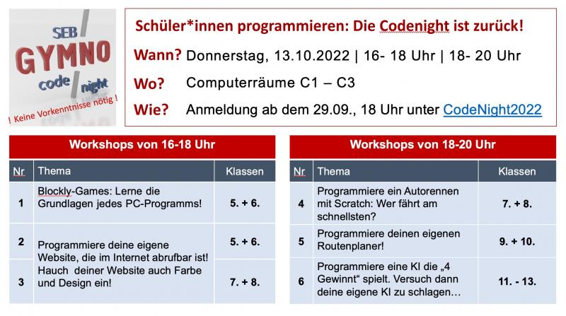

# Codenight 2022

_by Felix Peter Paul_

# Aushang in Schule

Du willst erste Programmiererfahrung sammeln und zum Beispiel ein Spiel selbst programmieren? Du willst eine eigene Website erstellen, mit deinen Lieblingsfarben und im individuellen Design? Oder willst du langfristig ein echter Hacker werden? In jedem Fall ist die CodeNight genau das Richtige für dich: Mit 3 jungen Informatik-Studenten wirst du Informatik neu erleben! 

**Donnerstag, 13. Oktober 2022 ab 16 Uhr**

Hier geht's zur Registrierung (! Ab dem 29.09., 18 Uhr!), welche wie die Bestellung eines Tickets abläuft. Dieses Ticket ist natürlich kostenlos. Du brauchst nur den Namen und deine E-Mail-Adresse anzugeben.

Es freut sich auf euch

der AK Code Night

 

 

**16 - 18 Uhr**

> Workshop 1: Blockly (5./6. Klasse)

Lerne die Grundlagen hinter jeder Website, jeder App und jedem Programm kennen!

Du musst nur eine Menge Spaß und Interesse mitbringen - Vorkenntnisse brauchst du keine. Du musst dich nicht mit lästiger Tipparbeit rumschlagen - es reicht das Zusammenziehen von Codeblöcken – das ist wie beim Bauen mit Lego.

[Link zu Blockly](https://blockly.games/)

> Workshop 2: Website programmieren (5./6. Klasse)

> Workshop 3: Website programmieren (7./8. Klasse)

Programmiere deine eigene Website, die du deinen Freunden und Eltern danach auch wirklich im Internet zeigen kannst. Über Inhalte, Farben und Design kannst du selbst entscheiden. 

Auch hier benötigst du keinerlei Vorkenntnisse.

[Link zur Beispielwebsite](https://fepaul-book.github.io/tierpark-website/)

**18 - 20 Uhr**

> Workshop 4: Autorennen programmieren mit Scratch (7./8. Klasse)

Hast du Lust, dein eigenes Computerspiel zu programmieren und selbst die Regeln festzulegen? Dieser Workshop gibt dir die Gelegenheit dazu, deine Ideen umzusetzen.

In diesem Workshop wird die Baukastenprogrammiersprache Scratch verwendet – es werden keinerlei Vorkenntnisse benötigt!

> Workshop 5: Routenplaner programmieren mit Scratch (9./10. Klasse)

Wie wäre es, wenn du in Zukunft mit deinem eigenen Routenplaner im individuellen Design den richtigen Weg finden könntest? Google Maps war gestern – hier entsteht Gymno Maps. Und je ausgeklügelter das Spiel, desto größer der Spaß!

Auch hier arbeitest du mit Scratch und Codeblöcken – denn auch damit kann man coole Sachen programmieren.

> Workshop 6: KI programmieren in Python (Oberstufe)

Hast Du schon einmal ein Spiel gegen einen Computer gespielt? Wie kommt es, dass der Computer meistens gewinnt? In diesem Workshop lernst du einen Code zu schreiben, der mit künstlicher Intelligenz arbeitet und darum nie verliert.

Hier arbeitest du mit Python. Also einer textbasierten Programmiersprache. Kleine Vorkenntnisse sind sicherlich von Vorteil, aber auf der Begleitwebsite findest du genug Informationen um auch ohne Vorkenntnisse, nur ein wenig Gehirnschmalz schnell eine coole KI zu schreiben!

Viel Spaß beim Programmieren!

# Website Ankündigung

Du willst erste Programmiererfahrung sammeln um langfristig ein echter Hacker zu werden? Du willst  mal eine eigene Website programmieren? Oder wie wäre es damit ein Spiel zu programmieren. Dann ist die CodeNight [^course] genau das richtige für dich. 

### Blockly (5./6. Klasse)

1 Workshop, 16-18 Uhr

Lerne die Grundlagen hinter jeder Website, jeder App und jedes Programms!

Du musst nur eine Menge Spaß und Interesse mitbringen - Vorkenntnisse brauchst du keine!
Du musst dich nicht mit lästiger Tipparbeit rumschlagen - es reicht das Zusammenziehen von Codeblöcken wie bei Lego.

[Link zu Blockly](  https://blockly.games/puzzle?lang=de)

### Website programmieren (5./6. Klasse + 7./8. Klasse)

je 1 Workshop, 16-18 Uhr

Programmiere deine eigene Website, die du deinen Freunden und Eltern danach auch wirklich im Internet zeigen kannst.

Auch hier benötigst du keinerlei Vorkenntnisse. 

[Link zur Beispielwebsite](https://fepaul-book.github.io/tierpark-website/Tiere/beispiel-loewe)

### Autorennen programmieren mit Scratch (7./8. Klasse)

1 Workshop, 18-20 Uhr

Programmiere ein cooles Spiel. Mal sehen wer nicht nur am besten spielt, sondern auch am besten programmiert!

In diesem Workshop wird die Baukastenprogrammiersprache Scratch verwendet - statt Tippfehlern gibt es hier coole Spiele!

### <del> Routenplaner</del> Ping Pong programmieren mit Scratch (9./10. Klasse)

1 Workshop, 18-20 Uhr

Je ausgeklügelter das Spiel, desto größer der Spaß!

Auch hier arbeitest du mit Codeblöcken - aber auch damit kann man die coolsten Dinge programmieren. 

### Ki programmieren in Python  (Oberstufe)
1 Workshop, 18-20 Uhr

Kannst du eine KI schreiben, die nie verliert?

Hier arbeitest du mit python. Also einer textbasierten Programmiersprache. Kleine Vorkenntnisse sind sicherlich von Vorteil, aber auf der Begleitwebsite findest du genug Informationen um auch ohne Vorkenntnisse mit ein wenig Gehirnschmalz schnell eine coole KI zu schreiben!

## Viel Spaß beim Programmieren!

[^course]: Dieses Buch wird in einem Workshop an einem Programmier-Schnuppertag eingesetzt und soll Spaß am Programmieren bereiten. Der Programmierkurs fand an einem Gymnasium in Rheinland-Pfalz im Jahr 2022 statt.
