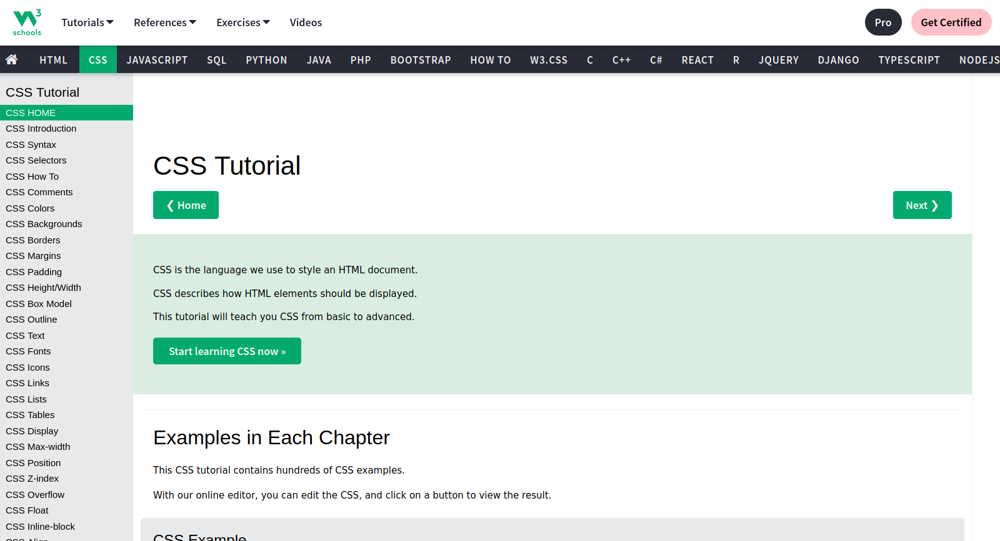

# CSS

Mit HTML *schreibt* man Websiten. 

Mit CSS **designed** man sie.

Das heißt CSS ist dafür da deine Website schön zu machen. 

> Da Programmierer sich enorm viel selbst beibringen müssen, sollst du auch diese Erfahrung mal machen. 
> 
> Gehe auf [W3Schools](https://www.w3schools.com/css/default.asp) und bringe dir CSS selbst bei!

