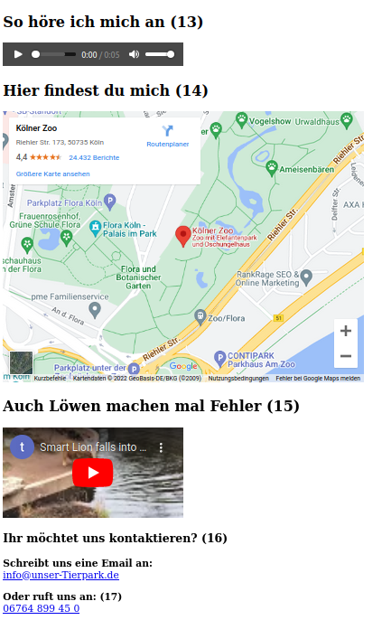

# coole Features

Das was du vorher gelernt hast ist ja ganz nett. 

Aber die coolen Dinge kommen erst jetzt. Ich meine Text fett drucken oder Tabellen anlegen ist essenziell aber wer legt nicht gerne eine

-  Google Maps Verknüpfung an, 

- verlinkt lustige YouTube Videos 

- oder bindet andere coole Dinge in seine Website ein, die man so braucht?

> 

**Im nächsten Abschnitt wirst du all das lernen!**
