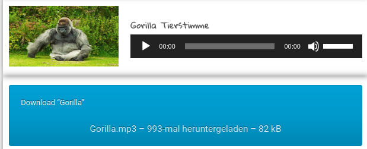

# Aufgaben

> ## ⚠️ Die folgenden Aufgaben kannst du in einer beliebigen Reihenfolge machen. Spiel einfach ein bisschen rum und mach **deine** Website zu einem Erlebnis!

## Aufgabe 1 - Bild

Füge das Wikipedia- Bild deines Tieres links neben dem ersten Absatz ein. 

(siehe Beispiel-Website Punkt 5)

## Aufgabe 2 - Ton

- Gehe auf [diese Website](https://freeanimalsounds.org/de/download-tierstimmen/) und suche nach deinem Tier.

- Wenn du es nicht findest such dir ein anderes Tier raus (es darf sich auch ganz anders anhören - es ist bestimmt lustig, wenn sich ein Affe anhört wie ein Elefant.

- Klicke mit **Rechtsklick** auf den großen blauen Button wo Download drauf steht und dann auf **Copy Link**. 
Das ist der Link, den du brauchst um den Ton zu verlinken. 

(siehe Beispiel-Website Punkt 13)

## Aufgabe 3 - Video

- Gehe auf YouTube und suche ein lustiges Video zu deinem Tier. 

- Wenn du keins findest, such einfach ein lustiges Katzen oder Hundevideo raus. 

> ⚠️ Bitte sucht keine anderen Videos. Ich werde nur ungern laut.

- Füge dein lustiges Video auf deiner Website ein.

(siehe Beispiel-Website Punkt 15)

## Aufgabe 4 - Google Maps

- Suche einen Ort eines Zoos in Europa mit [Google Maps](https://www.google.de/maps) heraus. (Der Zoo muss nicht dein Tier beherbergen) Verlinke den Ort des Zoos auf deiner Website so wie du es gelernt hast. 

(siehe Beispiel-Website Punkt 14)

## Aufgabe 5 - Kontaktdaten

- Denke dir Kontaktdaten aus! **(Nehme nicht deine eigenen und auch nicht die eines Freundes oder einer Person aus dem Internet!)**

    Eine kreative Emailadresse ist immer gut für einen Witz!

- Füge den Kontakt einer Person wie zuvor gelernt auf der Website ein. Sowohl als Email als auch als Telefon-Kontakt.

(siehe Beispiel-Website Punkt 16 und 17)

## Aufgabe 6 - Navigation

Füge ein Inhaltsverzeichnis ein, dass die folgenden Einträge hat:

- "Mein Tier"

- Lebensweise

- Fressen

Außerdem soll es einen Link am Ende der Website geben, mit dem man wieder zum Anfang der Website kommt. 

> ⚠️ Diese Aufgabe ist für die echten Profis!

19. Add Ons

Unterstreiche und streiche Text durch, indem du den ins und del Befehl probierst. Wofür könnten die Befehle stehen? Googel gegebenenfalls.

### ⚠️ Deine Website kann jetzt ungefähr so aussehen

 <iframe src="https://fepaul-book.github.io/tierpark-website/Tiere/beispiel-loewe.html" title="Beispiel-Website" height=100%; width=100%></iframe> 

> ## ⚠️ Wenn du schnell warst guck doch einfach mal in den nächsten **Abschnitt CSS** rein. Dort lernst du wie du Farbe in deine Website bekommst und sie generell schöner machst. 
