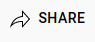
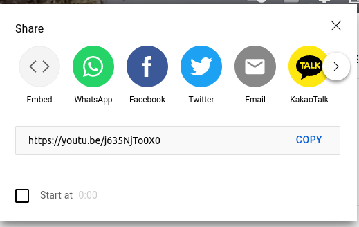

# Bilder, Video, Ton

## Bilder

Beim Einfügen von Bildern muss man mehrere Dinge einstellen. 

1. Welches Bild soll eingefügt werden? **src**

    Man kann sowohl Bilder von der eigenen Festplatte oder aus dem Internet verlinken. Im Prinzip geht beides gleich. Man sagt der Website wo das Bild zu finden ist. Mit dem *src* Befehl (src = source = Quelle) gibt man an welches Bild von wo geladen werden soll. Wir werden im folgenden einfach das Wikipedia Bild unseres Tieres verlinken. 

    Dafür klickt man mit Rechtsklick auf das Foto in Wikipedia und geht auf **Kopiere Link**

    Diesen Link fügt man dann bei src ein wie man im unteren Beispiel sieht.

2. Wo soll das Bild angezeigt werden? **style="float:right or left**

    Man kann einstellen wie Text um Bilder fließen soll. Also ob das Bild rechts oder links von Text ist oder ob es ganz frei stehen soll. Hierbei sind beim Design keine Grenzen gesetzt. Wir wollen aber im folgenden das Bild einfach rechts oder links vom Text anordnen. Dafür geben wir bei style right oder left an.

3. Wie groß soll das Bild angezeigt werden? **height:20%; width:20%;"**

    Die Größe des Bildes kann ebenfalls eingestellt werden. Die prozentuale Angabe ist dabei die prozentuale Größe in Abhängigkeit des Bildschirms (nicht des Bildes). Dadurch dass man Prozente verwendet statt cm wird das Bild auch auf kleineren Handybildschirmen schön dargestellt. 

> **heigth** steht dabei für Höhe und **width** für Breite

4. Was soll angezeigt werden, wenn das Bild nicht geladen werden kann? **alt="Alternativtext**

>    **Bild kann geladen werden**
> 
>     
> 
>    **Bild konnte nicht geladen werden**
> 
> 

Man muss einen Alternativtext angeben, sonst wird das Bild nicht in der Website sichtbar. Was vielleicht nervig erscheint ist aber sehr sinnvoll. Blinde Menschen können sich Websiten vorlesen lassen von Programmen. Da Blinde jedoch keine Bilder sehen können wird ihnen dann der Alternativtext vorgelesen, der das Bild beschreibt. So werden Websiten benutzerfreundlicher. 

Außerdem kann es bei schlechten Internetverbindungen dazu kommen, dass ein Bild nicht geladen werden kann. Dann wird auf der Website statt des Bilder einfach der Alternativtext angezeigt. So ist die Website auch bei schlechtem Internet nutzbar. 

Der Alternativtext wird mit dem *alt* Befehl angegeben (alt für alternative = Alternative)

 

Im folgenden siehst du ein **Beispiel** bei dem das Bild des Löwen von Wikipedia eingefügt wird:

              

> ⚠️Achtung mit dem **Urheberrecht**!
> Man darf nicht einfach alle Bilder aus dem Internet auf seiner eigenen Website verwenden! Man muss genau nachschauen, ob dies vom Fotografen auch erlaubt ist!
> 
> Bei Wikipedia darf man jedes Bild frei verwendent, sodass man diese Bilder bedenkenlos verwenden kann. 

## YouTube- Videos

YouTube - Videos kann man sehr einfach einfügen. Man macht dies mittels eines **iframes**, d.h. man fügt ein kleines Fenster ein, durch das man auf eine andere Website gucken kann (in diesem Fall YouTube) und sie benutzen kann, als wäre man auf der Website.

#### Probier es mal aus

<iframe width="300" height="150" src="https://www.youtube-nocookie.com/embed/j635NjTo0X0" title="YouTube video player" 
                frameborder="0" allow="accelerometer; autoplay; clipboard-write; encrypted-media; gyroscope; picture-in-picture" 
                allowfullscreen></iframe>
  
Du kannst das Video auf Vollbild machen, den Ton einstellen, Pause drücken und sogar auf den Kanal der Person gehen, die das Video hochgeladen hat. So als wärst du direkt auf YouTube.

Der Code zu dem oberen Beispiel sieht wie folgt aus:

        <iframe width="300" height="150" 
        src="https://www.youtube-nocookie.com/embed/j635NjTo0X0" 
        title="Löwe fällt in Wasser" 
        frameborder="0" allow="accelerometer; 
        autoplay; clipboard-write; 
        encrypted-media; gyroscope; picture-in-picture" 
        allowfullscreen></iframe>

Die Befehle bedeuten das folgende:

- **iframe**

    Gibt an, dass man ein Fenster zu einer anderen Website einbauen will.

- **width, height** 

    Gibt die Breite und Höhe des Fensters an.

- **src** 

    Gibt den Link zu dem Video an.

    Um ein YouTube-Video auf der eigenen Website so wie oben einzubinden, musst du wie folt vorgehen.

    - Rufe das Video auf YouTube auf.

    - Klicke auf Teilen oder Share unter dem Video. 

    - Es öffnet sich folgendes Fenster: 

    - Klicke auf den Copy Button und Kopiere damit den Link den du brauchst um das Video deiner Website hinzuzufügen. 

    - Füge den Link bei src in den Code ein. (Du kannst dir den Rest des Codes um ein Video einzufügen oben kopieren)

> ⚠️ Cooles Feature: Wenn du unten bei **start at** eine Zeit angbist (z.B. 1:20) dann startet das verlinkte Video automatisch später nach 1 Minute und 20 Sekunden. So kannst du langweilige Intros überspringen!

- **title** 

    Der Titel des Videos, das wird angezeigt, wenn das Video nicht geladen werden kann (wie *"alt"* vorher).

- **frameborder="0" allow="accelerometer; autoplay; clipboard-write; encrypted-media; gyroscope; picture-in-picture" allowfullscreen>** 
    
    Das stellt alles mögliche ein. Die Rahmenbreite (*frameborder*) um das Video, ob nach dem Video automatisch weitere Videos abgespielt werden sollen (*autoplay*) oder ob das Video im Vollbildmodus abgespielt werden darf (*allowfullscreen*)

> ⚠️ Das Standardvorgehen ist aber einfach den Quelltext von oben einmal zu kopieren und nur die **src, heigth, width und title** anzupassen!

## Ton einfügen

Ton einfügen ist im Gegensatz zu YouTube-Videos wirklich kinderleicht. 

<audio src="https://freeanimalsounds.org/de/startseite/download/1249/"
    controls>
    Das wird angezeigt, wenn die Videodatei nicht gefunden wurde.
</audio>

Der Code zu dem oberen Beispiel ist folgender:
            
        <audio src="https://freeanimalsounds.org/de/startseite/download/1249/"
        controls>
        Das wird angezeigt, wenn die Videodatei nicht gefunden wurde.
         </audio>

Um Ton oder Audio einzufügen, muss man auch nur sagen, welchen Ton man einfügen will (src) und einen Alternativtext angeben.
Mit dem **controls** Befehl gibt man an, dass man Play und Pause drücken kann, sowie die Lautstärke einstellen kann.
           

