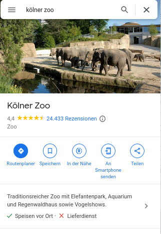
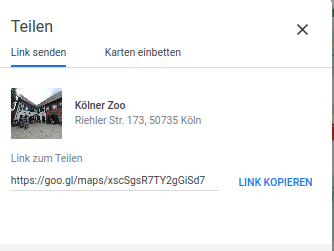
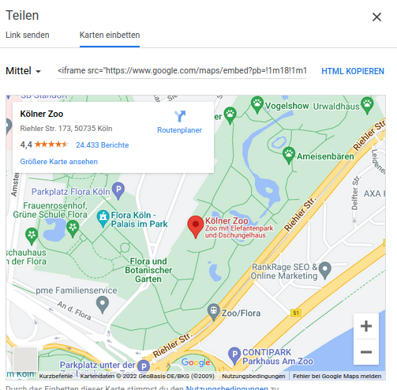
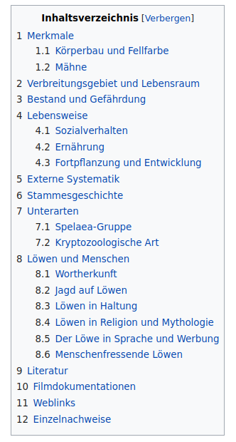

# GoogleMaps, Navigation, Kontaktdaten

## Google Maps 

<iframe src="https://www.google.com/maps/embed?pb=!1m18!1m12!1m3!1d2513.0494441768246!2d6.971761916003302!3d50.959790079548895!2m3!1f0!2f0!3f0!3m2!1i1024!2i768!4f13.1!3m3!1m2!1s0x47bf25931b47f54b%3A0x55f7266d24d0201f!2sK%C3%B6lner%20Zoo!5e0!3m2!1sde!2sde!4v1663282344190!5m2!1sde!2sde" 
width="600" height="450" style="border:0;" 
allowfullscreen="" loading="lazy" referrerpolicy="no-referrer-when-downgrade">
</iframe>

Um wie oben ein Fenster direkt zu einem Google Maps Standort zu erstellen musst du wie folgt vorgehen.

1. **Gehe auf [Google Maps](https://www.google.de/maps) und suche deinen Wunschort aus.**

2. **Klicke links bei der Anzeige deines Orts auf Teilen.**

3. **Klicke dann auf Karten einbetten.**

4. **Klicke auf HTML kopieren.**

5. **Füge den Link einfach so in deinen Websitecode ein und du bist fertig!**

> ⚠️  Eine Google Maps Verknüpfung zu machen ist wirklich nur kopieren und einfügen. Man muss nichts sonst machen! (Auch nichts selbst programmieren)

Der eingefügte Link sieht ungefähr so aus:

        <iframe src="https://www.google.com/maps/embed?pb=!1m18!1m12!1m3!1d2513.049444176829!2d6.971761916302123!3d50.9597900795488!2m3!1f0!2f0!3f0!3m2!1i1024!2i768!4f13.1!3m3!1m2!1s0x47bf25931b47f54b%3A0x55f7266d24d0201f!2sK%C3%B6lner%20Zoo!5e0!3m2!1sde!2sde!4v1664916393125!5m2!1sde!2sde" 
        width="600" height="450" 
        style="border:0;" 
        allowfullscreen="" 
        loading="lazy" referrerpolicy="no-referrer-when-downgrade"></iframe>

Man sieht, dass der Code genau so aufgebaut ist wie beim Einfügen eines YouTube-Videos.

Man muss angeben welchen Ort man einfügen will (src), wie groß das eingefügte Fenster sein soll (width, height) und ein paar zusätzliche Einstellungsmöglichkeiten gibt es noch die man einfach mitkopiert. 

## Kontaktdaten

Klicke auf die unten angegebene Email- Adresse und gucke was passiert. (Es sollte sich ein neues Fenster öffnen)

<a href="mailto:info@unserTierpark.de" title="Schreiben Sie uns eine E-Mail">Schreibe an info@unser-Tierpark.de</a>
 
<a href="tel:06764899450" title="Rufen Sie uns an">06764 899 45 0.</a>

 

Wenn man mit dem Handy die Website aufruft und auf die Telefonnummer klickt, öffnet sich automatisch das Anruffenster, in dem schon die Nummer eingetragen ist. 

Du siehst also, die Nummer und die Emailadresse werden nicht nur angezeigt, sondern dein Computer oder Handy weiß, dass es sich bei der Information um eine Email-Adresse oder Telefonnummer handelt und öffnet das entsprechende Programm. 

Um das hinzubekommen analysieren wir den folgenden Quelltext.

        <a href="mailto:info@unserTierpark.de" 
        title="Schreiben Sie uns eine E-Mail">Schreib an info@unser-Tierpark.de</a>
         
        <a href="tel:06764899450" 
        title="Rufen Sie uns an">06764 899 45 0.</a>

Eine Email oder Telefonnummer so einzufügen funktioniert im Prinzip wie das Einfügen eines normalen Links.

**Aber** hier muss man statt *src* (wird bei Links verwendet) href="mailto:EMAILADRESSE" verwenden. Das sagt dem Browser, dass er eine Email-Adresse erhält. Die angebene Emailadresse ist das wohin die Mail geschickt wird. 
Unter title ist wieder das angegeben, was für Blinde Personen vorgelesen wird. Danach wird der Text angeben, der auf der Website angezeigt wird um automatisch das Mail-Programm mit der richtigen Emailadresse zu öffnen. 

Bei der Telefonnummer geht es genau so. 

## Navigation

Es ist nervig auf großen Websites immer von ganz oben nach ganz unten zu scrollen. Wie bei Wikipedia Artikeln ist es praktisch ein Inhaltsverzeichnis zu haben und einfach direkt an eine bestimmte Stelle auf der Website zu springen. 

Dies macht man auch über Links, aber weil man keine andere Website verlinkt, sondern Teile der eigenen Website, muss man die Links leicht anders erzeugen. 

1. Man muss den Teil der Website benennen den man verlinken will (also den Bereich wo man hinspringen will - es bietet sich an zu Überschriften zu springen)

2. An der Stelle an der man den Link einfügen will muss man angeben, wohin man springen will.

> **Beispiel eines Inhaltsverzeichnisses:**
>        <h1 id="top">Inhaltsverzeichnis</h1>
>        <a href="#erster_Teil">Mein Tier</a> 
>        <a href="#zweiter_Teil">Merkmale</a> 
>        <a href="#dritter_Teil">Lebensweise</a>  
>
><h4 id="erster_Teil"> Hi, ich bin Simba </h4> 
>    ...        
><h4 id="zweiter_Teil"> Merkmale</h4>  
>    ...        
><h4 id="dritter_Teil"> Lebensweise</h4>
>    ...
> 
> <a href="#top">Nach oben</a>

**Der Quelltext zu dem oberen Beispiel sieht wie folgt aus.**

Das Inhaltsverzeichnis wurde mit diesem Code erzeugt:

        <h1 id="top">Inhaltsverzeichnis</h1>
        <a href="#erster_Teil">Mein Tier</a> 
        <a href="#zweiter_Teil">Merkmale</a> 
        <a href="#dritter_Teil">Lebensweise</a>  

Die Überschriften mussten aber alle vorher benannt/markiert worden sein.

        <h4 id="erster_Teil"> Hi, ich bin Simba </h4> 
            ...        
        <h4 id="zweiter_Teil"> Merkmale</h4>  
            ...        
        <h4 id="dritter_Teil"> Lebensweise</h4>

        <a href="#top">Nach oben</a>

#### Hinzufügen eines Inhaltsverzeichnisses

1. Zuerst fügt man den Überschriften immer **id=name** hinzu.

2. Danach kann man mit einem Link zu der Überschrift springen.
       
         <a href="#name">Name des Links (oft einfach die Überschrift)</a>
    
    Mit dem href gibt man an wohin man springen will. Bemerke, dass ein Hashtag # vor den Namen geschrieben werden muss, an den man springen will. 
        

