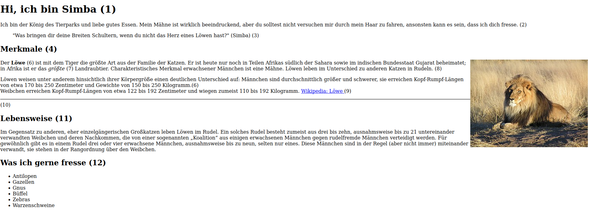
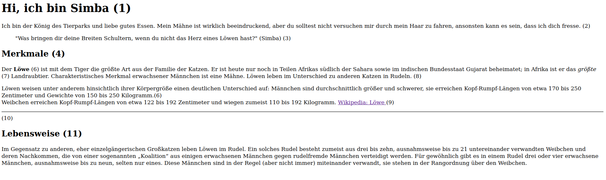

# Aufgaben

**Orientiere dich an der Website** 

[Löwe Beispielwebsite](https://fepaul-book.github.io/tierpark-website)

1. > Erstelle eine große Überschrift 

(siehe Beispielwebsite Punkt 1)

2. > Erstelle einen Absatz. 

(siehe Beispielwebsite Punkt 2)

3. > Erstelle ein Zitat. Gehe dazu auf [diese Website](https://www.myzitate.de) 

(siehe Beispielwebsite Punkt 3)

4. > Erstelle eine kleinere Überschrift.

(siehe Beispielwebsite Punkt 4)

6. > Mache ein Wort fett.

(siehe Beispielwebsite Punkt 6)

7. > Mache ein Wort kursiv.

(siehe Beispielwebsite Punkt 7)

8. > Erstelle einen weiteren Absatz.

(siehe Beispielwebsite Punkt 8)

9. > Erstelle einen Link zur Wikipedia Seite deines Tieres, wobei auf der Website "Wikipedia: Tiername" stehen soll.

(siehe Beispielwebsite Punkt 9)

10. > Erstelle eine horizontale Linie.

(siehe Beispielwebsite Punkt 10)

11. > Erstelle eine weitere kleine Überschrift.

(siehe Beispielwebsite Punkt 11)

### ⚠️ Deine Website sollte jetzt ungefähr so aussehen 

