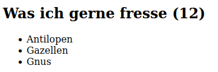
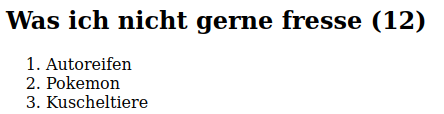
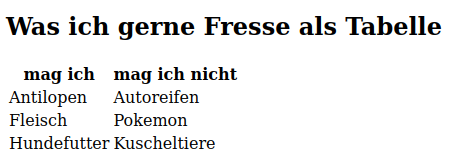
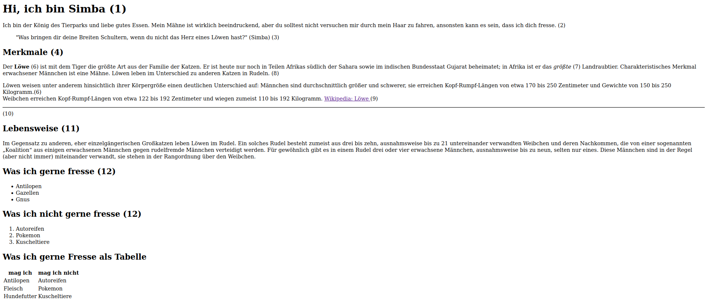

# Aufgabe 1

Gehe auf den [Wikipedia Artikel](https://wikipedia.org) deines Tieres und lies dir durch, was dein Tier gerne frisst.

Erstelle anschließend eine *unsortierte* Liste mit 10 Dingen die dein Tier mag. Du kannst dir hier auch ein paar Dinge ausdenken)

> 

# Aufgabe 2

Denk dir 10 Dinge aus, die dein Tier wahrscheinlich *nicht* mag . (Denke dir gerne was lustiges aus wie z.B. Autoreifen, Steine, Kuscheltiere, ...)

Erstelle anschließend eine sortierte Liste mit diesen 10 Dingen.

> 

# Aufgabe 3

Erstelle eine Tabelle die in der ersten Zeile die Spaltenüberschriften: "mag", "mag nicht" enthält.
Und in den Spalten dann jeweils deine 10 Dinge die dein Tier gerne frisst oder eben nicht.

> 

### ⚠️ Deine Website sollte jetzt ungefähr so aussehen 

