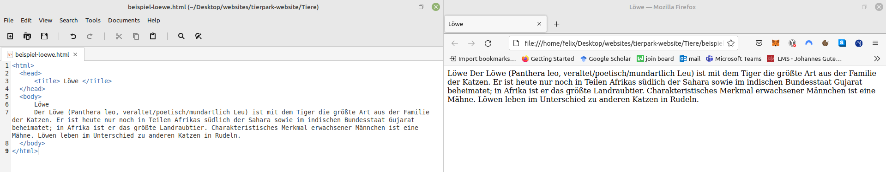

# Aufgaben

Wie du schon weißt wirst du in diesem Kurs deine eigene Website zu einem Tier in einem Tierpark programmieren.

> Die Seite für den [Löwen Simba](https://fepaul-book.github.io/tierpark-website/Tiere/beispiel-loewe.html) wurde schon programmiert. An dieser sollst du dich im folgenden orientieren. 

## Aufgabe 1

Solltest du die Datei deines Tieres noch nicht als Website und im Editor geöffnet haben, so öffne die Datei jetzt wie zuvor beschrieben.

## Aufgabe 2

Gehe auf [Wikipedia](https://de.wikipedia.org/wiki/Wikipedia:Hauptseite) und suche nach deiner Tierart.

Kopiere die ersten zwei Absätze und füge sie in den **body** im Editor-Fenster ein. 

**Rücke deinen Text mit Leerzeichen ein** bisschen ein, dann bleibt dein Code übersichtlicher!

> ⚠️ **Wieso sehe ich keine Änderung auf der Website?**
> 1. Speichere mit <kbd>Strg</kbd> + <kbd>S</kbd> deine Änderungen im Editor-Fenster ab.
> 2. Klicke mit der Maus anschließend in das Website Fenster und drücke <kbd> F5</kbd>. Dadurch aktualisiert sich die Website und du siehst deine Änderungen. 

##### Perfekt du hast deine erste Änderung vorgenommen!

### ⚠️ Deine Website und dein Code sollten jetzt ungefähr so aussehen

Wie du siehst hast du obwohl du einen Zeilenumbruch in deinem Code hast, keinen Zeilenumbruch in deiner Website. 
Außerdem sieht deine Website noch sehr schlecht aus - darum kümmern wir uns im folgenden!
