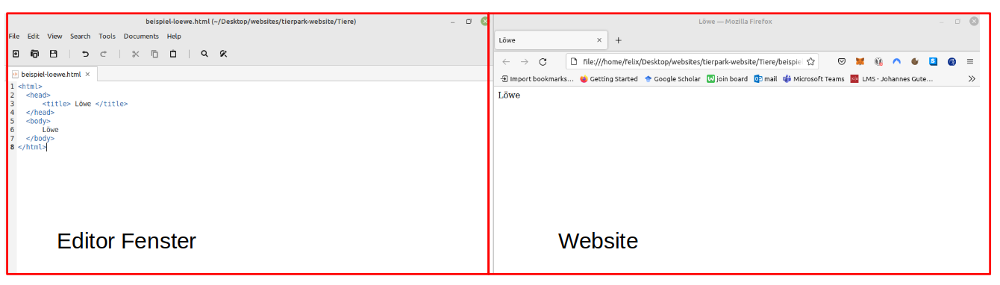

# Wie programmiere ich meine erste Website

## Einrichten der Programmierumgebung

##### Öffnen der Website

Öffne die Datei die nach deiner Tierart benannt ist mit einem **Doppelklick**. 
Es sollte sich eine Website öffnen, die komplett weiß ist und auf der sonst nur der Name deiner Tierart steht. 

Drücke anschließend <kbd></kbd> + <kbd>→</kbd>

Dadurch ist die angezeigte Website nur auf der rechten Hälfte deines Bildschirms.

##### Öffnen des Editors

Klicke anschließend mit der rechten Maus auf die gleiche Datei wie zuvor (der Datei die nach deinem Tier benannt ist).


Drücke auf öffnen mit und wähle "Text Editor".
Es öffnet sich ein Fenster in das du tippen kannst. In diesem Fenster stehen 8 Zeilen Text/ Code der schon eine kleine Website programmiert.

Drücke <kbd></kbd> + <kbd>←</kbd>

Dadurch ist das Editorfenster nur auf der linken Hälfte des Bildschirms.

Dein Bildschirm sollte jetzt wie folgt aussehen. 




##### Erklärung des Codes

``` { .html }
<html> 
  <head>
      <title> Löwe </title>
  </head>
  <body>
      Löwe
  </body>
</html>
```


Du kannst auf der linken Seite 8 Zeilen Code sehen. 

Die 1. und 8. \<html\> Zeile Code sagen dem Computer nur, dass es sich um HTML Code also eine Website handelt.

<a name="befehlsrahmen"> Jeder Befehl hat einen öffnenden und schließenden Teil </a>
> ⚠️Bemerke, dass sich die 1. und 8. Zeile leicht unterscheiden! 
> 1. Zeile \<html/>
> 8. Zeile \<**\/** html\>
Jeder Befehl umrahmt den Text für den er gilt. Den Teil in der ersten Zeile nennt man Befehlsöffner, den Teil in der 8. Zeile Befehlsschließer. 

In der zweiten und 4. Zeile ist dementstprechend der Befehlsöffner und Schließer für den Kopfteil einer Website. Hier stehen Informationen über die Website die für Suchmaschinen (wie Google) wichtig sind. In deinem Fall steht hier allerdings nur der Titel deiner Website. Dieser Titel steht ganz oben in der Leiste im Browser.
Sonst wirst du vorerst nichts in den head Teil schreiben.

In Zeile 5 und 7 wird der Body (Körper) deiner Website eingerahmt. **Das ist der Bereich in dem man eine Website programmiert und der auf der Website angezeigt wird** Hier wirst du reinschreiben.

In Zeile 6 siehst du den Namen deiner Tierart. Diese siehst du auch auf deiner Website.
Im folgenden wirst du genau hier neuen Text usw. einfügen.
