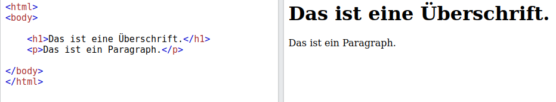

# Was ist Html?

HTML steht für [Hyptertext Markup Language](https://de.wikipedia.org/wiki/Hypertext_Markup_Language).

HTML ist ein Grundbaustein des Internets. 

**Alle Webseiten sind in HTML geschrieben.**

Mit HTML schreibt man nicht nur Text wie in Word, sondern man gibt Informationen mit was welcher Textteil bedeutet. 

Beispielsweise gibt man an welche Teile des Textes Überschriften oder Zitate etc. sind. HTML gibt nicht an wie Überschriften etc. dargestellt werden. 

Es gibt nur an, dass es sich bei dem betreffenden Text um eine Überschrift handelt. Der Browser (z.B. Mozilla Firefox oder Google Chrome) stellt Überschriften aber automatisch größer und fett gedruckt dar. 

Im Vergleich zu Word klickt man also nicht nur den Knopf "Überschrift" an und schreibt dann eine Überschrift, sondern man muss den Text der eine Überschrift sein soll einrahmen in den Befehl für die Überschrift. (\<h1\>)

> Eine gute Quelle um HTML zu lernen ist [W3Schools](https://www.w3schools.com/html/default.asp). Lasse dir hierfür die Website automatisch von Google übersetzen. Diese Option solltest du rechts oben angezeigt bekommen. 

Will man konkret angeben, wie etwas dargestellt wird, so kann man mit der Programmiersprache CSS angeben welche Farbe, welche Größe usw. ein Textteil haben soll. Zu CSS findest du auch gute Informationen unter [W3Schools](https://www.w3schools.com/css/) oder in diesem Buch.

