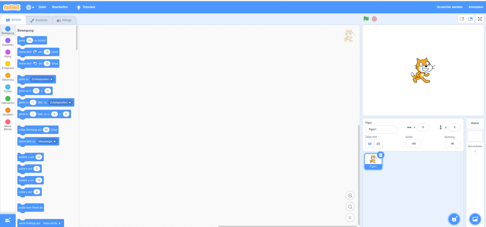
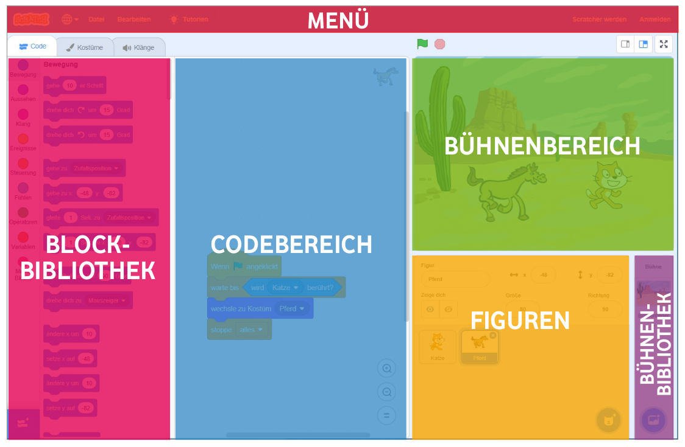

# Wie funktioniert Scratch

Wenn du auf [Scratch](https://scratch.mit.edu/projects/editor/?tutorial=getStarted) gehst siehst du zunächst folgenden:

Das ist deine Programmierumgebung in der du dein Spiel erstellen wirst.

Die Oberfläche ist in verschiedene Bereiche eingeteilt.

- **Blockbereich** Hier sind deine Programmierbausteine, mit denen du programmierst. Durch ziehen in den Codebereich programmierst du.

- **Codebereich** Alle Blöcke die hier sind, sind dein Programm. Den Blockbereich und den Codebereich wirst du die ganze Zeit verwenden.

- **Bühnenbereich** Hier siehst du was dein Programm macht, wenn du links oberhalb des Bühnenbereichs auf die grüne Fahne klickst. 

- **Figuren** Am Anfang hat man immer die Scratch Katze die man programmiert. Man kann jedoch im Figuren- Bereich andere Figuren hinzufügen und auch diese programmieren.

> ⚠️ Jede Figur hat ihren eigenen Codebereich. Das heißt wenn du eine Figur anklickst siehst du nur die Codeblöcke die du für diese Figur programmiert hast! 

- **Bühnenbibliothek** Hier kannst du Hintergründe für den Bühnenbereich laden.

Eine gute Einführung in Scratch findest du [hier](https://www.youtube.com/watch?v=Z26lgMxQuzk) als Video.

### Speichern 

Willst du dein Projekt speichern, so kannst du links oben auf **Datei**  und dann **Auf Computer speichern** gehen.

Später kannst du dein Projekt hier auch wieder hochladen.
