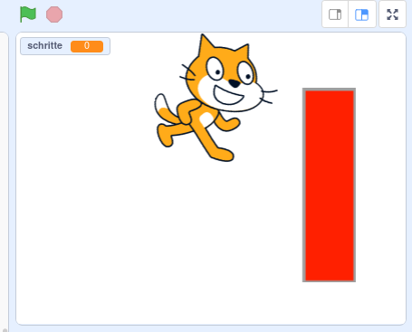
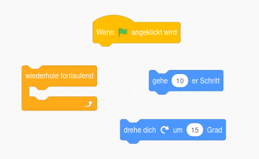
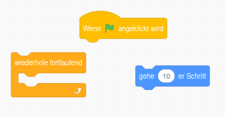
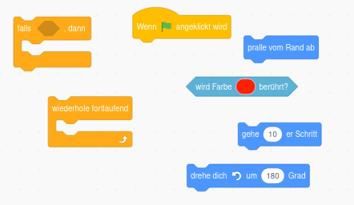

# Scratch kurze Übung

**So sieht deine Bühne später aus!**

- Mache die Katze größer!
  
  Klicke dafür auf die Katze und gucke welche Einstellungen du findest.

- Lasse die Katze im Kreis laufen. 

  Nutze dafür die folgenden Blöcke.

> ## Mit dem Klicken auf die grüne Fahne rechts oben startest du das Programm!

- Gehe rechts unten auf neue *Figur anlegen - malen* und zeichne ein rotes Rechteck.

  Anschließend musst du oben links wieder auf *Scripte* klicken und dann auf die Katze klicken. So kannst du die Katze wieder programmieren. 

- Lösche die Codeblöcke, die die Katze im Kreis laufen lassen. 

- Lasse die Katze mit den folgenden Codeblöcken von links nach rechts laufen.

- Lasse die Katze automatisch umkehren, wenn sie das Rechteck berührt. Lasse die Katze auch umkehren, wenn sie den Rand der Bühne berührt. (Nutze zum Testen, ob das Rechteck berührt wird, die **Pipette** um die Farbe des Rechtecks auszuwählen)
 
  Nutze dafür die folgenden Codeblöcke.

# Jetzt bist du bereit richtig zu programmieren!

> ### Lösche alle Codeblöcke!
