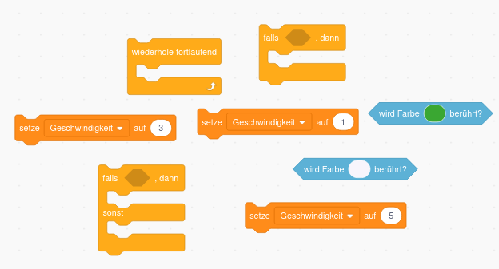
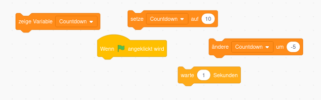

# Tipps

# Wunschliste an Autorennen

## 1. Auto erstellen

Das bekommst du ohne Hilfe hin.

 

## 2. Bühnenbild enwerfen (Hintergrund)

Das bekommst du ohne Hilfe hin.

## 3. Steuerung des Autos programmieren

Du benötigst die folgenden Blöcke:

**Manche Blöcke brauchst du mehrmals!**

 

## 4. Geschwindigkeit einrichten

> ⚠️ Um die Farben richtig einzustellen kannst du auf die kleine Pipette klicken und die Farbe direkt auf der Rennstrecke auswählen.

Du benötigst sonst nur die folgenden Blöcke:

> Du musst diese Blöcke nicht an die anderen anhängen!

## 5. Countdown beim Start einrichten

**⚠️ Kann dein Auto schon vor Ablauf des Timers starten?**

Du benötigst nur die folgenden Blöcke:

## 6. Rundenzähler einbauen

Das kennst du schon alles. 

- Variablen

- Farbe berühren

Mehr brauchst du fast nicht. 

## 7. Stoppuhr programmieren

## 8. Töne hinzufügen

## 9. Spielgegner erstellen

## 10. Rennstrecke, Auto ändern

- Du kannst das alte Bühnenbild jederzeit wiederherstellen wenn du in den Bühnenbereich gehst. 

> ⚠️ Achte darauf welche Farben du wählst, weil ansonsten dein Auto vielleicht problemlos über den Rasen fahren kann.

- Lade ein Bild eines Lambroghini, Ferrari, Porsche oder Oldtimer runter und speichere das Bild auf dem Computer ab. Dann versuche es im Figurenbereich zu laden.
 

## 11. Rundenzähler nur erhöhen wenn man von einer Richtung kommt

Frage die x Koordinate des Autos ab, bevor es über die Linie fährt. 

## 12. Gegenstände einbauen die auf der Straße liegen, fährt man dagegen, bleibt man stehen

Wenn du so weit gekommen bist, brauchst du keine Tipps mehr. Überlege dir selbst wie du es machen willst und probiere einfach aus.

