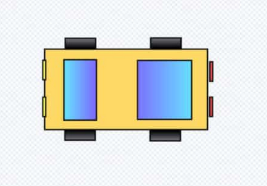
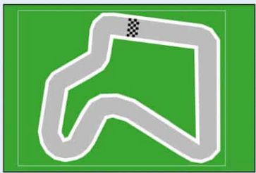

# Wunschliste an Autorennen

## 1. Auto erstellen

Erstelle dein ganz eigenes Auto. Du kannst dich am oberen Bild orientieren. 

- Gehe dazu im Figurenbereich (rechts unten) auf **Figur wählen - Malen**.

- Zeichne dein Auto aus Rechtecken (bei dem Bild oben sind 11 Rechtecke)

- Wähle coole Farben für dein Auto.

 

## 2. Bühnenbild enwerfen (Hintergrund)

Um deine Rennbahn zu erstellen gibt es zwei Möglichkeiten. Du erstellst deine eigene oder du lädst eine Vorlage.

Wir wollen zunächst die Rennbahn **laden** und später kannst du deine eigene erstellen.

  - Klicke mit Rechsklick auf das Bild der Rennbahn. 

  - Klicke auf "Save Image as" und speichere das Bild auf dem Computer.

  - Gehe im Bühnenbereich auf *Bühnenbild hochladen* und wähle die gespeicherte Rennstrecke aus.

> Lösche jetzt die Scratch Katzenfigur und ändere die Größe deines Autos so ab, dass es gut auf die Strecke passt. (Es gibt extra eine Möglichkeit eine Figur größer oder kleiner zu machen. Du musst das Auto nicht neu zeichnen. Mal sehen ob du sie findest)

## 3. Steuerung des Autos programmieren

Sobald man auf die grüne Fahne klickt, soll das Spiel starten. 

Dann muss man **dauerhaft** abfragen, ob eine der Pfeiltasten gedrückt wird und beim Pfeil nach oben mehrere Schritte gehen und bei den Pfeiltasten nach links und rechts sich leicht drehen. Du kannst auch einen Rückwärtsgang einbauen.

> Probiere zuerst ohne Hilfe und mit viel Probieren dein Auto zum Fahren zu bekommen. 
>
> Ansonsten gucke unter Tipps nach welche Blöcke du benötigst!

 

## 4. Geschwindigkeit einrichten

Wenn das Auto von der Fahrbahn abkommt, soll es langsamer werden.

Das heißt ein Auto hat verschiedene Geschwindigkeiten, die es fahren kann:

- auf Wiese

- wenn es den weißen Straßenrand berührt

- sonst fährt es normal schnell

Programmiere diese verschiedenen Geschwindigkeiten deines Autos!

#### Tipps für alle

Diese Aufgabe ist etwas schwer, deshalb hier ein paar Tipps.

Bei der Steuerung deines Autos hast du gesagt wie viele Schritte es fährt, wenn man die Pfeil nach oben Taste drückt. 

Hier musst du jetzt die Anzahl der Schritte anpassen, je nachdem welche Farbe der Strecke dein Auto berührt. 

Um die Geschwindigkeit zu speichern benötigst du eine Variable (einen Speicherplatz um die Geschwindigkeit zu speichern).

Gehe auf **Variablen - Neue Variable - Nur für diese Figur - nenne sie Geschwindigkeit** - ziehe diese Variable, in das Feld wenn man Pfeil nach oben drückt. 

Weitere Tipps findest du auf der Tipps Seite.

## 5. Countdown beim Start einrichten

Bevor das Rennen startet, soll ein Countdown angezeigt werden. 

Der Countdown läuft von 3 runter bis 0 und soll natürlich in Sekunden sein. 

Auch hier benötigst du wieder eine Variable. Aber diese muss für alle Figuren gelten.

> Versuche es ohne Tipps, eigentlich kannst du das schon alles!

## 6. Rundenzähler einbauen

Immer wenn du über die Ziellinie fährst soll der Rundenzähler um eins erhöht werden. 

Hier benötigst du wenn überhaupt nur noch eine kleine Hilfe. 

## 7. Stoppuhr programmieren

Es soll die Rundenzeit angezeigt werden. 

- Also wenn der Countdown fertig ist startet die Stoppuhr.

- Nach jeder Runde (über Ziellinie gefahren) wird die Stoppuhr angezeigt und dann zurückgesetzt für die nächste Runde. 
 

## 8. Töne hinzufügen

## 9. Spielgegner erstellen

## 10. Rennstrecke, Auto ändern

- Gehe auf Bühnenbild wählen und dann malen. Jetzt kannst du deine eigene Rennstrecke mit mehr Kurven zeichnen. 

- Anstelle des selbst gezeichneten Autos kannst du auch ein Foto eines echten Autos einfügen. Suche dir das coolste Auto raus was du mit Google finden kannst und nutze das anstelle deines selbstgezeichneten Autos.  
 

## 11. Rundenzähler nur erhöhen wenn man von einer Richtung kommt

Man soll nicht schummeln können, indem man gar keine Runde gefahren ist und rückwärst über die Ziellinie fährt. 

## 11. Gegenstände einbauen die auf der Straße liegen, fährt man dagegen, bleibt man stehen

Es sollen braune Kisten auf der Straße sein. Wenn  man gegen die fährt bleibt man 1 Sekunde stehen, aber die Kiste verschwindet danach. 

