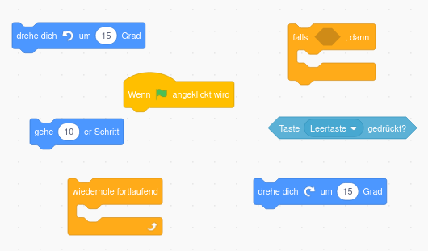

# Tipps

## 1. Spieler erstellen

Um die Katze unsichtbar zu machen, klicke zuerst auf die Katze und gucke dann weiter.

Um Figuren hinzuzufügen musst du rechts unten im Figurenbereich suchen.

 

## 2. Spielfeld erstellen

 

## 3. Eigenen Schläger steuern

 

## 4. Gegner-Schläger erstellen

 

## 5. Spielball erstellen

Nutze zum Erstellen des Balls zwei Kreise (einen äußeren großen und einen inneren kleinen). 

Wenn du keine Lust hast einen Ball zu erstellen, kannst du auch hier eine Vorlage verwenden. Später wirst du aber eh einen eigenen cooleren Ball erstellen, also empfehle ich den Ball selbst zu erstellen. 

- [Ball](img/vorlagen/ball.jpg)

 

## 6. Richtung des Balls einstellen

 

## 7. Anstoß

 

## 8. Ball abprallen lassen

 

## 9. Treffermeldung

 

## 10. Punktestand anzeigen

 

## 11. Töne einfügen

 

## 13. Sieg anzeigen

#### Satz 

#### Spiel

 

## 14. Aufschlag

 

## 15. Stoppuhr für Ballwechsel

> # ⚠️ Wenn du so weit bist kannst du dich an einer der folgenden Aufgaben versuchen!

 

## Steuerung des Schlägers ändern

Du benötigst folgende Codeblöcke um deinen Schläger mit Pfeiltasten zu steuern. Manche Blöcke benötigst du mehrmals und du musst die Tasten und die Gradzahl natürlich abändern. 

 

## Mehrere Bälle

 

##  Eigene Schläger erstellen

 

## Eigene Tischtennisplatte erstellen

