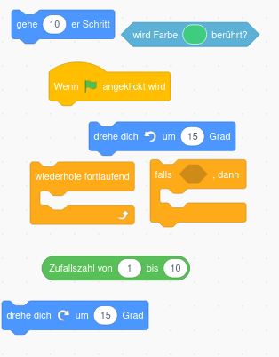
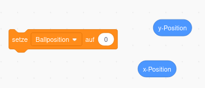
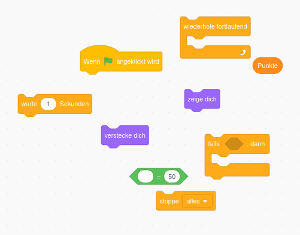

# Tipps

## 1. Spieler erstellen

Um die Katze unsichtbar zu machen, klicke zuerst auf die Katze und gucke dann weiter.

Um Figuren hinzuzufügen musst du rechts unten im Figurenbereich suchen. Gib erst an, welche Farbe der Kreis haben soll und zeichne ihn erst danach!

Du kannst den Griff des Schlägers durch ein Rechteck darstellen, dass du drehen kannst, wenn du es angeklickt hast. 

Du musst die Größe des Schlägers anpassen. Klicke dazu zuerst auf den Schläger und gucke dann weiter.

> ⚠️ Um die Farbe eines Kreises zu ändern musst du erst auf das Mauswerkzeug wechseln!

 

## 2. Spielfeld erstellen

Der Bühnenbereich ist ganz rechts unten in Scratch. 

Um die Vorlage zu laden gehe wie folgt vor: 

> Folge dem Link
> 
> - [Spielfeld](img/vorlagen/spielfeld.jpg)
> 
> Klicke dann mit Rechtsklick auf das Bild. Speichere es mit "Speichern unter" auf deinem Computer. Klicke dann auf "Bühnenbild hochladen" rechts unten. 

 

## 3. Eigenen Schläger steuern

Um den eigenen Schläger immer zu deinem Mauszeiger wandern zu lassen benötigst du nur die folgenden drei Codeblöcke.

 

## 4. Spielball erstellen

- Nutze zum Erstellen des Balls einen Kreis. 

- Der Ball ist eine neue Figur!

- Du benötigst zum Steuern des Ball wieder nur 4 Codeblöcke. 

  Suche nach einem Codeblock mit *Gehe Schritte* und einem mit *pralle von Wand* ab. (Denke an die grüne Flagge und dass der Ball sich **dauerhaft** bewegen soll.) 

 

## 5. Ball abprallen lassen

- Um den Ball vom Schläger abprallen zu lassen benötigst du die folgenden 8 Codeblöcke.

- Wähle die zufällige Richtungsänderung die addiert wird im Bereich -45 bis 45 Grad.

> Wenn der Ball nicht abprallt und dein Schläger einen Rand hat, wähle als Farbe des Schlägers nicht dir Randfarbe sondern die Farbe der Fläche aus. 

 

## 6. Gegner-Schläger erstellen

Zeichne den Gegner Schläger genau so wie du vorher deinen eigenen gezeichnet hast. 

> Denke daran, dass der Gegner Schläger einen eigenen Codebereich hat, der jetzt noch leer ist. D.h. der Schläger macht noch nichts. 

 

## 7. Gegner automatisch spielen lassen  (schwer!)

- Erstelle eine Variable *Ballposition* und setze sie auf die y-Position des Balls. Dieser Code muss zum **Ball** gehören. Du benötigst **nur zwei** der unteren Codeblöcke.

- Nutze die Variable Ballposition, indem du **dauerhaft** nach dem Anklicken der grünen Fahne in die Richtung des Balls gleitest. Ändere dabei entweder die x oder die y-Koordinate, nicht aber beide! Dieser Code gehört zum **Schläger des Gegners**!

- 0.3 Sek sollte ein guter Wert sein. 

> Solltest du richtige Probleme haben den Schläger des Gegners Richtung Ball zu bewegen kannst du unter diesem [Link](img/top-tipp.png) die nötigen Code-Blöcke finden.

- Zum Abprallen des Balls beim gegnerischen Schläger gucke den Code ab **wird Farbe berührt**

 

## 8. Punkte vergeben

Um Punkte zu vergeben musst du zwei Variablen anlegen. 

- eine Variable merkt sich die *Punkte von Spieler 1*

- eine Variable die Punkte des *PC-Gegners*

Erhöhe die Variable, wenn der Ball eine bestimmte Farbe berührt. 

- Das zurücksetzen einer Variable bedeutet, sie auf Null zu setzen. Das muss ganz am Anfang eines Codeblocks getestet werden. Ob du das beim Ball oder bei einem Schläger machst ist egal.

- Die Mitte des Spielfeldes ist bei den **Koordinaten 0 und 0**.

> Mehr Tipps bekommst du vor Ort von mir wenn nötig.

## 9. Siegesmeldung 

Um die Vorlagen zu laden orientiere dich am laden des Spielfeldes.

Du benötigst außerdem die folgenden Codeblöcke:

## 11. restliche Aufgaben

#### Wenn du so weit gekommen bist, bist du schon echt gut. Probiere einfach selbst etwas rum und frage vor Ort nach wenn du eine Frage hast. 

Ein paar kleine Tipps gibt es nur noch zu den folgenden Aufgaben. 

 

## 15. Stoppuhr für Ballwechsel

Du benötigst eine Stoppuhr, die nach jedem Punkt direkt zurückgesetzt wird. Du kannst die Stoppuhr stoppen, wenn eine Farbe berüht wurde. Achte darauf dauerhaft die Bedingungen zu testen!

## Steuerung des Schlägers ändern

Du benötigst folgende Codeblöcke um deinen Schläger mit Pfeiltasten zu steuern. Manche Blöcke benötigst du mehrmals und du musst die Tasten und die Gradzahl natürlich abändern. 

 
