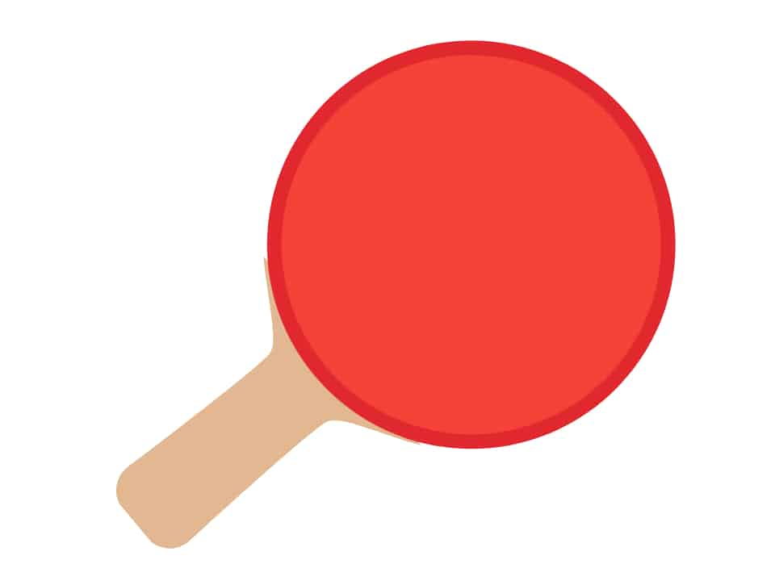
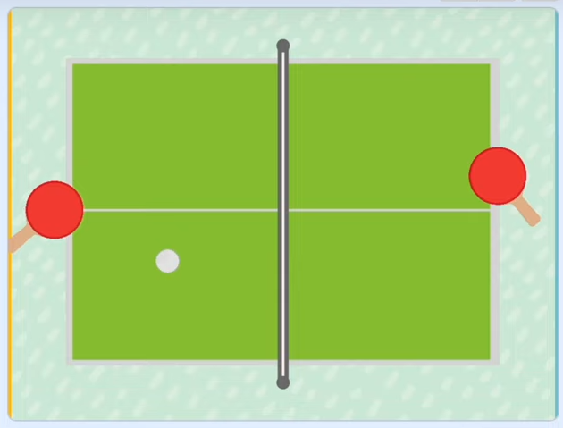
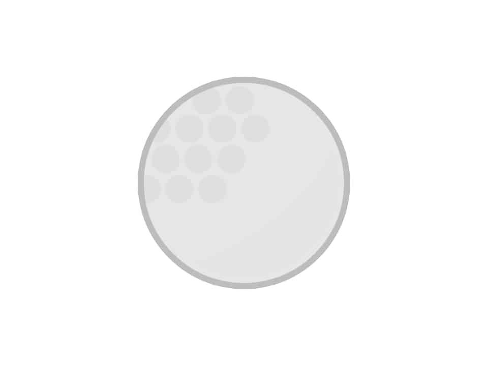

# Wunschzettel

## 1. Spieler erstellen

- Anstelle der Katze, wollen wir Schläger haben die sich bewegen. 
  Mache dafür die Katze unsichtbar. Mal sehen ob du den Button dafür findest.

- Lade jetzt die Vorlagen des Schlägers. *Öffne* den Link. Klicke dann mit Rechtsklick auf das Bild. Speichere es mit "*Speichern unter*" auf deinem Computer. Anschließend klicke in Scratch rechts unten auf "*Figur hochladen*".

  - [Spieler 1](img/vorlagen/spieler.jpg)

 

## 2. Spielfeld erstellen

Ein cooles Spielfeld ist wichtig für jedes Spiel. 

- Erstelle selbst ein Spielfeld, dass genau so aussieht wie das untere (nur ohne die Schläger)

- Achte darauf, die gleichen Farben wie im Bild zu wählen 
  - rechter Rand blau
  -  linker Rand gelb
  - Netz besteht aus einem weißen Streifen mit einem schwarzen Rand
  - die Tischtennisplatte hat einen grauen Rand
  - der Hintergrund hat eine ganz andere Farbe als alles andere 

 

> ## ⚠️ Wenn du keine Lust hast ein Spielfeld zu malen  kannst du auch die folgende Vorlage verwenden.

- [Spielfeld](img/vorlagen/spielfeld.jpg)

Klicke dann mit Rechtsklick auf das Bild. Speichere es mit "Speichern unter" auf deinem Computer. Klicke dann auf "Bühnenbild hochladen" rechts unten. 

 

## 3. Eigenen Schläger steuern

 

## 4. Gegner-Schläger erstellen

 

## 5. Spielball erstellen

- Erstelle einen Ball der wie folgt aussieht. 

- Der Rand des Balles hat eine andere Farbe als das innere und der Rand sollte dick genug sein. 

- Gehe dazu unten im Figurenfenster auf malen und male deinen eigenen Ball mit Kreisen.

 

## 6. Richtung des Balls einstellen

 

## 7. Anstoß

 

## 8. Ball abprallen lassen

 

## 9. Treffermeldung

 

## 10. Punktestand anzeigen

 

## 11. Töne einfügen

 

## 13. Sieg anzeigen

#### Satz 

- Ein Satz wird von dem Spieler gewonnen, der zuerst 11 Punkte erzielt hat.
- Haben beide Spieler 10 Punkte erreicht, geht es in die Satzverlängerung.
- Es gewinnt derjenige den Satz, der zuerst mit 2 Punkten Vorsprung führt (Beispiel: 12:10, 13:11 etc.).

> Programmiere, eine Satzanzeige. Das heißt frage richtig ab, ob bis 11 oder weitergespielt wird. Ermittele den Gewinner und zeigen dann z.B. 1:0 Sätze oben an. 

#### Spiel

- Im Mannschaftsspielbetrieb wird ein Spiel solange gespielt, bis ein Spieler zuerst drei Sätze gewonnen hat.
- Im Höchstfall können also fünf Sätze gespielt werden. Bei einem 2:2 Satzgleichstand bringt der fünfte Satz die Entscheidung.

> Programmiere eine Meldung, die zeigt wer das Spiel gewonnen hat. 

 

## 14. Aufschlag

Countdown bei Aufschlag

 

## 15. Stoppuhr für Ballwechsel 

- Erstelle eine Stoppuhr die nach jedem Aufschlag anzeigt, wie lange gespielt wurde, bis ein Punkt erzielt wurde. 
- Zähle auch die Anzahl der Schläge bis zum Punkt. 

z.B. 20sec, 5 Schläge

 

> # ⚠️ Wenn du so weit bist kannst du dich an einer der folgenden Aufgaben versuchen!

 

## Steuerung des Schlägers ändern

- Anstatt den eigenen Schläger mit der Maus zu navigieren, wollen wir das mit Pfeiltasten machen. 

- Kopiere dafür deinen Ball, mache ihn dann unsichtbar und ändere die Steuerung des neuen Balls auf Pfeiltasten. 
  So hast du falls etwas schief läuft noch deinen alten gut funktionierenden Schläger.

- Gucke gerne unter Tipps nach wie du mit Pfeiltasten steuern kannst. 

 

## Mehrere Bälle

- Erstelle einen zweiten Ball. (Du musst ihn nicht neu programmieren du kannst den alten kopieren)

- Überlege dir selbst, wer am Anfang den zweiten Ball haben soll. 

 

##  Eigene Schläger erstellen

Anstelle des vorgefertigten Schlägers, kannst du auch einen ganz eigenen erstellen. Gehe dazu auf Figur erstellen. Lass deiner Fantasie freien Lauf. 

> ⚠️ Achte aber darauf deinen Code an deinen neuen Schläger anzupassen, sonst funktioniert dein Spiel nicht mehr.
 

 

## Eigene Tischtennisplatte erstellen

Erstelle gerne eine eigene Tischtennisplatte, mit z.B.

- Löchern

- Stellen die den Ball verlangsamen

- Stellen die den Ball verschnellern 

- Stellen die den Ball umlenken
